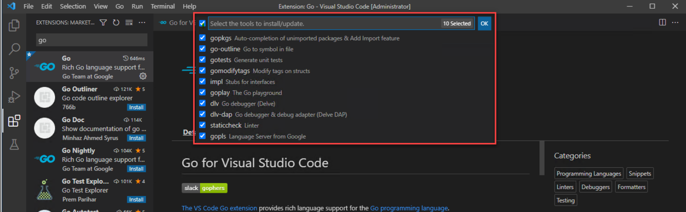
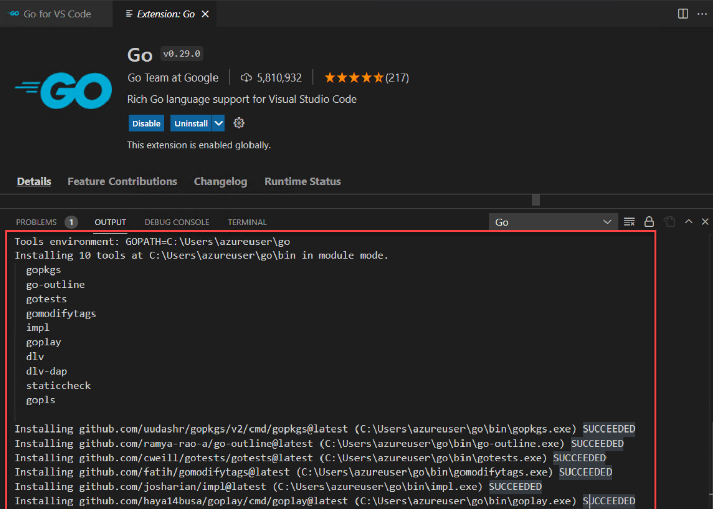

# 环境搭建
## Prerequisites
### 下载golang
windows 平台选择 xxx网址下载
linux平台选择 wget xx 命令下载
### 设置
go env -w GO111MODULE=on


# Goland环境
## 1.下载Goland
### goland 设置
#### 设置


#### 字体


#### Enable Go Module


## 2.Goland + Vscode plugin
### 下载plugin到本地
https://plugins.jetbrains.com/plugin/12132-leetcode-editor

### Import to Goland


### 亮点功能介绍
优点 自定义代码模板

缺点 创建了不想要的文件夹


### 代码模板
#### 链表
```
package linkedlist
import (
"go_learn/leetcode/util"
)
//${question.frontendQuestionId}.${question.title} lang=golang
type ListNode = util.ListNode
```

# VScode+Golang+Leetcode环境搭建（不推荐）

先下载golang，然后下载10.32.2版本的nodejs，然后下载1.17.6的golang，然后安装vscode的go插件，然后就可以开始写代码了！

## 2.配置vscode的golang环境
### 2.1 下载go extension

### 2.2 下载go tools
ctrl+shift+p -> 输入go update


勾选所有的tools


科学上网后，结果如下图

## 3.leetcode插件
安装leetcode 插件


安装nodeJs之后，Vscode的OUTPUT会抛出一个奇怪的错误，什么toString is underfined(没有截图)，但是其实已经登录成功了，
仔细看，是说拿user profile的时候抛出的，不影响使用。

# 其他工作

