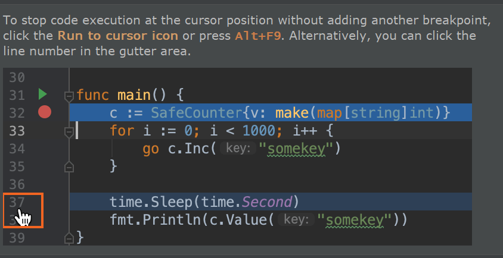

# Goland tips
突然注意到，当你重新启动goland得时候，他每次都会弹出一个 tips of the day, 然后驻足查看一下，
是教你一些使用goland的技巧！

### 1.debugging tips

不需要打断点，只需要点一下表示行数的数字，即可以快速的开始愉快的debug!

# Tools
## 测试工具

### gotests
go get -u github.com/cweill/gotests/...
gotests -all -w filename.go