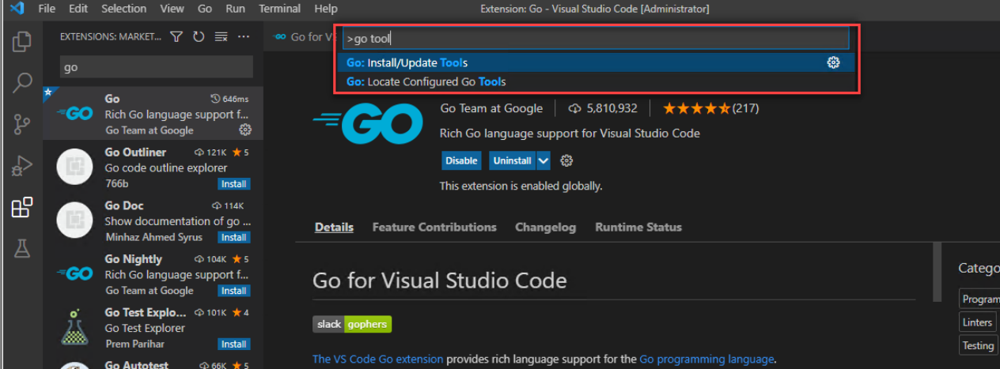
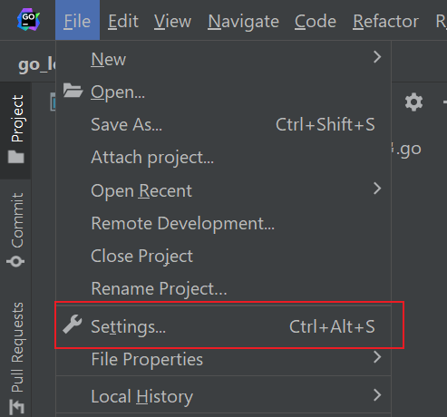

# VScode+Golang+Leetcode环境搭建

## 1.下载golang

windows 平台选择 xxx网址下载
linux平台选择 wget xx 命令下载

先下载golang，然后下载10.32.2版本的nodejs，然后下载1.17.6的golang，然后安装vscode的go插件，然后就可以开始写代码了！

## 2.配置vscode的golang环境
### 2.1 下载go extension

### 2.2 下载go tools
ctrl+shift+p -> 输入go update

勾选所有的tools

科学上网后，结果如下图

## 3.leetcode插件
安装leetcode 插件

安装nodeJs之后，Vscode的OUTPUT会抛出一个奇怪的错误，什么toString is underfined(没有截图)，但是其实已经登录成功了，
仔细看，是说拿user profile的时候抛出的，不影响使用。

# goland 环境搭建

## goland 设置

### 设置

### 字体

### Enable Go Module

# 其他工作

## 测试工具

### gotests
go get -u github.com/cweill/gotests/...
gotests -all -w filename.go