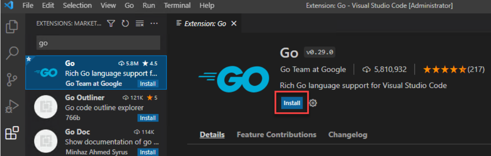
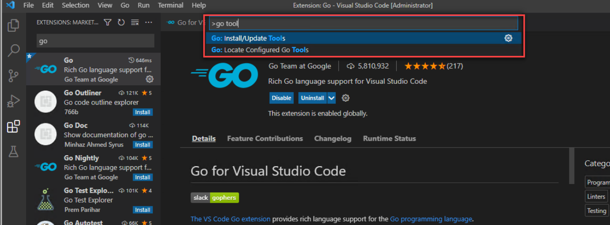
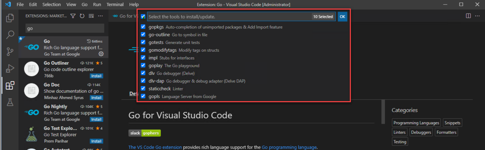
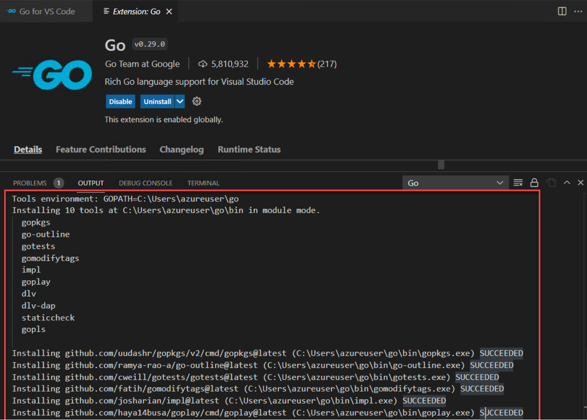
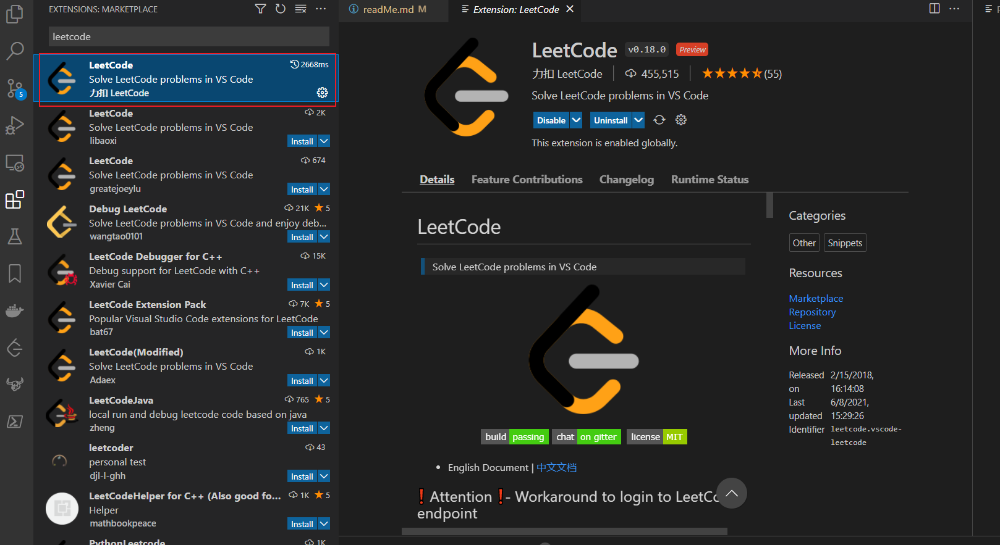
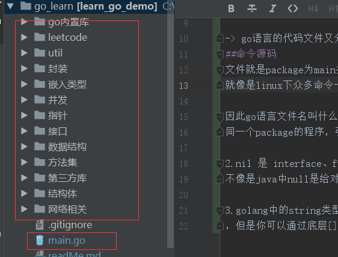
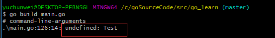
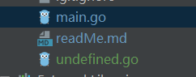

# Introduction
这是一个记录刷题和学习Golang的仓库。过去3年以来，对golang一知半解，浑浑噩噩。

希望这次2022/2/7回归!可以保持更新频率!
2022/5/16回归!可以保持更新频率!

保证每日一题的同时，记录学习golang的每一篇文章。

# VScode+Golang+Leetcode环境搭建

## 1.下载golang

windows 平台选择 xxx网址下载
linux平台选择 wget xx 命令下载

先下载golang，然后下载10.32.2版本的nodejs，然后下载1.17.6的golang，然后安装vscode的go插件，然后就可以开始写代码了！

## 2.配置vscode的golang环境
### 2.1 下载go extension

### 2.2 下载go tools
ctrl+shift+p -> 输入go update

勾选所有的tools

科学上网后，结果如下图

## 3.leetcode插件
安装leetcode 插件

安装nodeJs之后，Vscode的OUTPUT会抛出一个奇怪的错误，什么toString is underfined(没有截图)，但是其实已经登录成功了，
仔细看，是说拿user profile的时候抛出的，不影响使用。

# Leetcode 刷题规范

- 0.拿到题目，先在注释中写出来，应该问哪些问题，和面试官交流哪些东西？（假设题目给的是模糊的）
- 1.要先思考一些corner cases,最后以单元测试的形式沉淀下来
- 2.给每一道题，打上label
- 3.是否需要加一些断言，使得程序健壮性更好？
- 4.要学会反思，code clean/性能优化/注释/变量命名更加规范

# golang 学习笔记

## 1命令源码文件和库源码文件

### 命令源码文件
文件就是package为main并且有一个main函数的代码文件，命令源码文件可以接受参数
就像是linux下众多命令一样，因此可以很方便的写出命令工具。

一般标准的go工程目录结构是下图这样的，一个代码入口，其他都是库源码文件。

###库源码文件
库源码文件就是存在package非main的包中的代码，等待着被引用

###go命令和源码文件
最常见的go run 和go build 

- go build 

用于编译我们指定的源码文件或代码包以及它们的依赖包，但是之前遇到一种情况，和main.go同一个包下有库源码文件，然后main.go
有引用其代码，会报错**undefined**

为了规避这样的问题，go build 可以指定代码路径而不单独一个文件

## 2.go语言package和main意义

在golang项目中，只有package为main，且有main函数的代码是入口。
单个程序想要执行必须是package为main，才能执行其中的main函数。
多个这样的程序在一个目录下时，无法启动整个目录（为什么要启动整个目录，因为
程序之间有引用，不启动整个会报错，找不到某某）。
因此go语言文件名叫什么无所谓，引用其他代码时，只跟着package层次目录走（两个不同文件名
同一个package的程序，引用时路径一样，和文件名无关）

## 3.go中的nil
nil 是 interface、function、pointer、map、slice 和 channel 类型变量的默认初始值,
不像是java中null是给对象的默认值（习惯在java中检测字符串=="" && == null" go只需要 =="" 因为字符串没有nil"）

## 4.go中的string
golang中的string类型类似java的String类，都是不可变的，也就是你可以修改String对象的引用，但是无法直接修改底层的某个值
，但是你可以通过底层[]byte,[]rune获得并修改，byte是字节，rune是字符（一个字符可能由多个字节组成）

## 5.go语言中的反射
